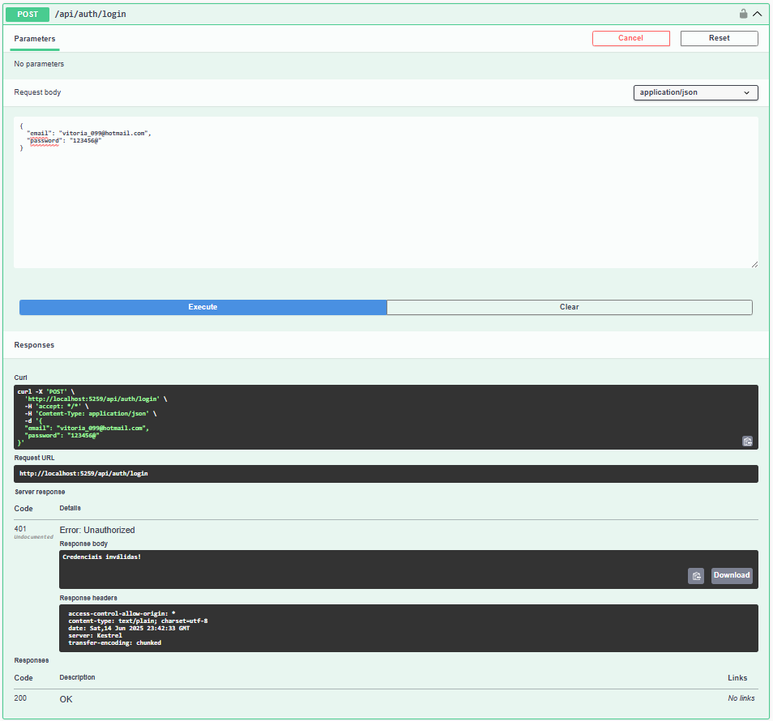
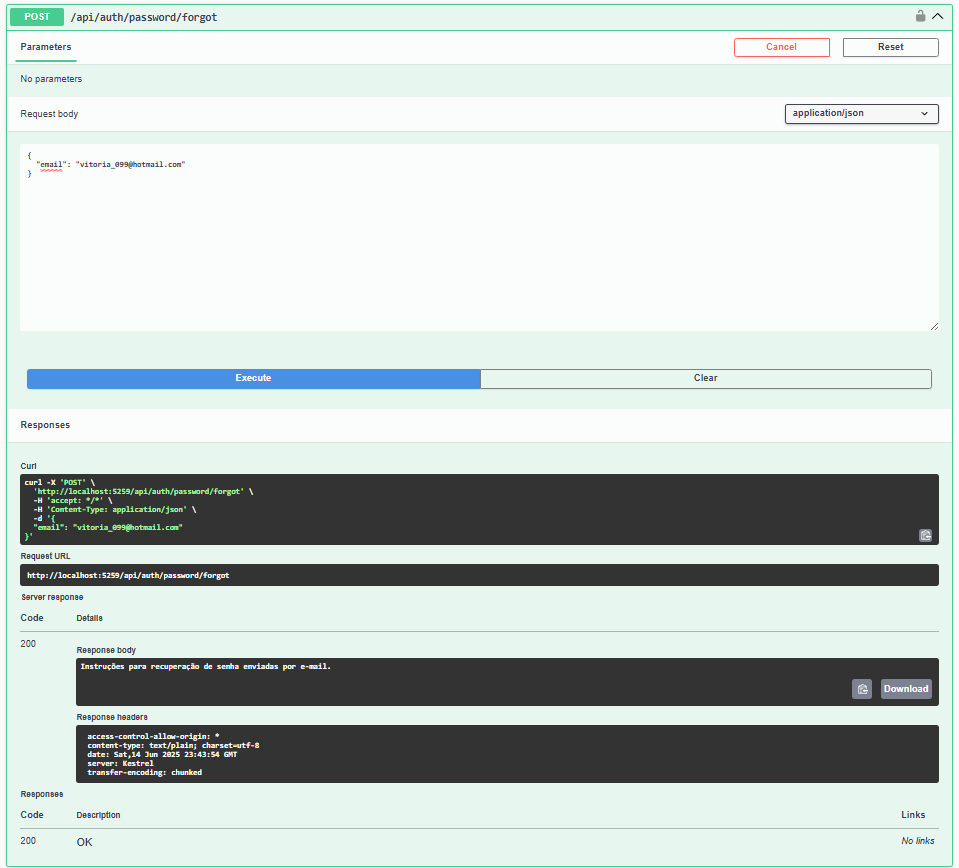

🧪 Documento de Testes – Microserviço de Autenticação
📋 Informações Gerais
Projeto: MSAuthentication

Responsável: Vitória Gabriella

Data: 2025-06-14

🚦 Testes Realizados
🔐 Registro de Usuário
Endpoint: POST /api/auth/register
Request:

{ "email": "teste@exemplo.com", "password": "Senha123!" }
Esperado: Usuário criado com sucesso

Obtido: ✅ OK

🔑 Login Correto
Endpoint: POST /api/auth/login
Request:

{ "email": "teste@exemplo.com", "password": "Senha123!" }
Esperado: Usuário autenticado e token JWT retornado

Obtido: ✅ OK

🔐 Login Incorreto
Endpoint: POST /api/auth/login
Request:

{ "email": "teste@exemplo.com", "password": "senhaErrada" }
Esperado: Retorno Unauthorized (erro de autenticação)

Obtido: ✅ OK

🔄 Recuperação de Senha
Endpoint: POST /api/auth/password/forgot
Request:

{ "email": "teste@exemplo.com" }
Esperado: Envio de email de recuperação de senha

Obtido: ✅ OK

🛠️ Próximos Passos

Implementar validação de regras de segurança para senhas
Automatizar testes (unitários e integração)

Dica: Atualize esse documento sempre que fizer novos testes para manter tudo fresquinho! 🌸

